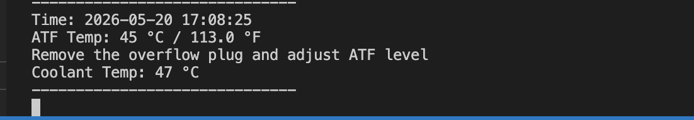
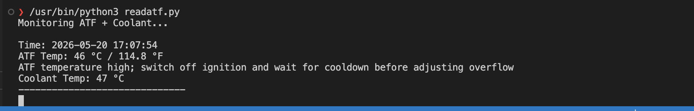

# Toyota 4Runner ATF Temperature Reader

This script reads automatic transmission fluid (ATF) temperature using a cheap [ELM327](https://en.wikipedia.org/wiki/ELM327) OBD-II dongle on a Toyota 4Runner (5th Gen). It is useful when performing a transmission fluid flush to monitor the ATF temperature.

> Verified using Toyota ATF debug mode by shorting pins 4 and 13, confirming readings match the ATF debug (ATF Temperature Detection) mode indication.

## Tested on
- 2017 Toyota 4Runner SR5

## Requirements
- Python 3
- `pyserial`
- ELM327-compatible USB serial adapter or Bluetooth dongle

## Setup

Download this repository. If youa are someone who is not familiar with github, you can click on the green "Code" button and select "Download ZIP". Then extract the contents to a folder on your computer. Run commands 2 & 3 in that folder.

1. Install Python (choose based on your operating system): 
   - Windows: [Python for Windows](https://www.python.org/downloads/windows/)
   - Mac: Python is pre-installed, but you can install the latest version from [Python for Mac](https://www.python.org/downloads/macos/)
   - Linux: Use your package manager (e.g., `sudo apt install python3` on Debian/Ubuntu)
 
2. Install dependencies:
   ```bash
   pip install -r requirements.txt
   ```
3. Edit `readatf.py` and update the `PORT` constant to match your USB serial device.
   - Windows example: `COM3`
   - Mac/Linux example: `/dev/ttyUSB0` or `/dev/tty.usbserial-1460`. Do `ls /dev/tty.usb*` to see available devices.

## Usage
To Run the script on Linux/macOS:
```bash
python3 readatf.py
```

The script initializes the ELM327 adapter and repeatedly reads:
- ATF temperature (`2182` command)
- Coolant temperature (`0105` command) - to monitor engine warm-up

It prints the values every 30 seconds. Adjust the sleep duration in the code if you want more or less frequent updates.

## Example Screen Captures

- Normal:  adjust ATF level when temp is between 104°F and 113°F (40°C to 45°C)

  

- Over-temp: Wait for ATF to cool down

  

## Notes
- Make sure the adapter is connected to the vehicle and the ignition is on.
- This tool is intended for monitoring transmission fluid temperature during maintenance on a 5th Gen 4Runner. It may work on other Toyota  models by adjdusting the corresponding OBD AT commands
- LLM assisted code. 
